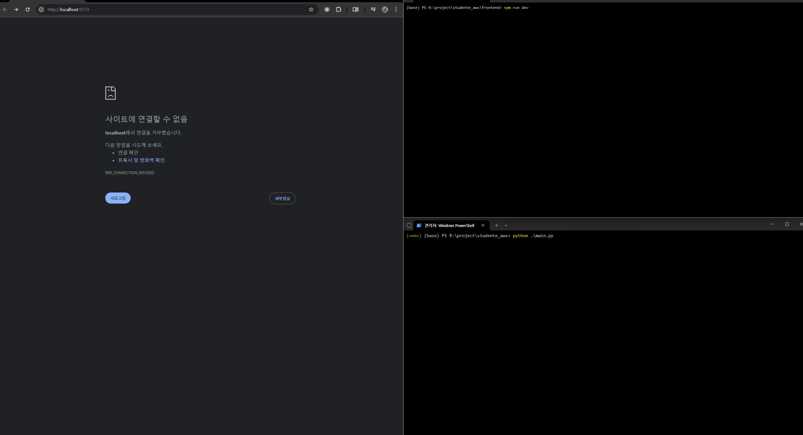

# AWS Monitoring System



*Read this in: [English](#aws-monitoring-system) | [한국어](#aws-모니터링-시스템) | [日本語](#aws監視システム) | [中文](#aws监控系统)*

## Overview

AWS Monitoring System is a comprehensive tool for real-time monitoring and management of AWS resources. The application provides a user-friendly interface to track EC2 instances, ECS clusters, and EKS clusters across multiple regions, combined with local system activity monitoring capabilities.

## Features

- **Real-time AWS Resource Monitoring**:
  - EC2 Instances: Track instance status, type, and availability zone
  - ECS Clusters: Monitor service count, task count, and status
  - EKS Clusters: View version information, node count, and health status

- **System Activity Monitoring**:
  - Keyboard and mouse activity detection
  - Screen state monitoring
  - Audio activity detection
  - Active window tracking

- **Interactive Dashboard**:
  - WebSocket-based real-time updates
  - Interactive resource management interface
  - Custom filter and search capabilities

## Getting Started

### Prerequisites

- Python 3.9+
- Node.js 16+
- AWS credentials configured

### Installation

1. Set up the backend:
   ```bash
   pip install -r requirements.txt
   python setup.py install
   ```

2. Set up the frontend:
   ```bash
   cd frontend
   npm install
   npm run dev
   ```

3. Reset AWS credentials if needed:
   ```bash
   python reset_credentials.py
   ```

### Building Executable

For Windows:
```
.\build_executable.ps1
```

For Linux/MacOS:
```
./build_executable.sh
```

---

# AWS 모니터링 시스템

## 개요

AWS 모니터링 시스템은 AWS 리소스를 실시간으로 모니터링하고 관리하기 위한 종합 도구입니다. 이 애플리케이션은 여러 리전에 걸쳐 EC2 인스턴스, ECS 클러스터 및 EKS 클러스터를 추적할 수 있는 사용자 친화적인 인터페이스를 제공하며, 로컬 시스템 활동 모니터링 기능이 통합되어 있습니다.

## 기능

- **실시간 AWS 리소스 모니터링**:
  - EC2 인스턴스: 인스턴스 상태, 유형 및 가용 영역 추적
  - ECS 클러스터: 서비스 수, 작업 수 및 상태 모니터링
  - EKS 클러스터: 버전 정보, 노드 수 및 상태 확인

- **시스템 활동 모니터링**:
  - 키보드 및 마우스 활동 감지
  - 화면 상태 모니터링
  - 오디오 활동 감지
  - 활성 창 추적

- **인터랙티브 대시보드**:
  - WebSocket 기반 실시간 업데이트
  - 대화형 리소스 관리 인터페이스
  - 사용자 정의 필터 및 검색 기능

## 시작하기

### 필수 조건

- Python 3.9 이상
- Node.js 16 이상
- AWS 자격 증명 구성

### 설치

1. 백엔드 설정:
   ```bash
   pip install -r requirements.txt
   python setup.py install
   ```

2. 프론트엔드 설정:
   ```bash
   cd frontend
   npm install
   npm run dev
   ```

3. 필요한 경우 AWS 자격 증명 재설정:
   ```bash
   python reset_credentials.py
   ```

---

# AWS監視システム

## 概要

AWS監視システムは、AWSリソースをリアルタイムで監視および管理するための包括的なツールです。このアプリケーションは、複数のリージョンにわたるEC2インスタンス、ECSクラスター、およびEKSクラスターを追跡するためのユーザーフレンドリーなインターフェースを提供し、ローカルシステムのアクティビティ監視機能も統合されています。

## 特徴

- **リアルタイムAWSリソース監視**:
  - EC2インスタンス: インスタンスの状態、タイプ、可用ゾーンの追跡
  - ECSクラスター: サービス数、タスク数、状態の監視
  - EKSクラスター: バージョン情報、ノード数、健全性状態の表示

- **システムアクティビティ監視**:
  - キーボードとマウスの活動検出
  - 画面状態のモニタリング
  - 音声アクティビティの検出
  - アクティブウィンドウの追跡

- **インタラクティブダッシュボード**:
  - WebSocketベースのリアルタイム更新
  - インタラクティブなリソース管理インターフェース
  - カスタムフィルターと検索機能

## 始め方

### 前提条件

- Python 3.9以上
- Node.js 16以上
- AWS認証情報の設定

### インストール

1. バックエンドのセットアップ:
   ```bash
   pip install -r requirements.txt
   python setup.py install
   ```

2. フロントエンドのセットアップ:
   ```bash
   cd frontend
   npm install
   npm run dev
   ```

3. 必要に応じてAWS認証情報のリセット:
   ```bash
   python reset_credentials.py
   ```

---

# AWS监控系统

## 概述

AWS监控系统是一个全面的工具，用于实时监控和管理AWS资源。该应用程序提供了用户友好的界面，可跟踪多个区域的EC2实例、ECS集群和EKS集群，并结合本地系统活动监控功能。

## 功能

- **实时AWS资源监控**:
  - EC2实例: 跟踪实例状态、类型和可用区
  - ECS集群: 监控服务数量、任务数量和状态
  - EKS集群: 查看版本信息、节点数和健康状态

- **系统活动监控**:
  - 键盘和鼠标活动检测
  - 屏幕状态监控
  - 音频活动检测
  - 活动窗口跟踪

- **交互式仪表板**:
  - 基于WebSocket的实时更新
  - 交互式资源管理界面
  - 自定义筛选和搜索功能

## 开始使用

### 先决条件

- Python 3.9+
- Node.js 16+
- 已配置AWS凭证

### 安装

1. 设置后端:
   ```bash
   pip install -r requirements.txt
   python setup.py install
   ```

2. 设置前端:
   ```bash
   cd frontend
   npm install
   npm run dev
   ```

3. 如需重置AWS凭证:
   ```bash
   python reset_credentials.py
   ```

